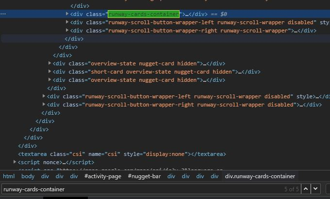
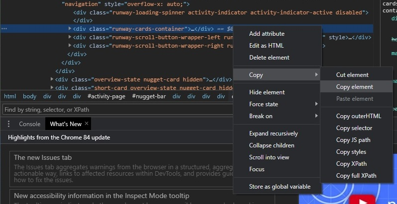

# google-timeline-data

Usage guide:

go to this page:

```
https://www.google.com/maps/timeline?pli=1&pb
```

press F12 or right click and inspect the page


click here in the bottom left of the page:


press ctrl + f while in the inspect tab, and search for the last instance of the text 'runway-cards-container'



copy that element and paste it into a text document called locations.txt

*the text document must be in the same folder as the extract_locations.py file*



double click the extract_locations.py file

open the visited_locations.txt document to find a list of your visited locations
